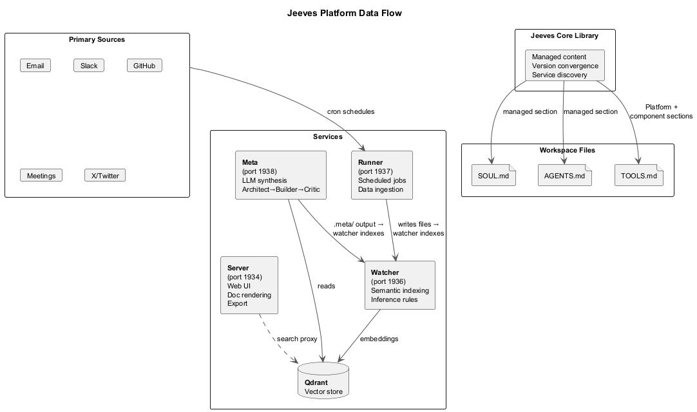
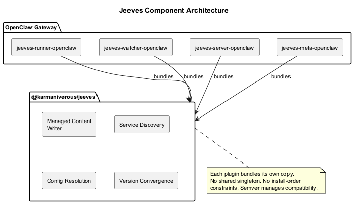

# Platform Overview

Jeeves is an identity and data services layer for [OpenClaw](https://openclaw.ai). OpenClaw provides the gateway, sessions, tools, and messaging. Jeeves adds professional discipline, operational protocols, and a suite of services for ingesting, indexing, synthesizing, and presenting your data.

## Core Principle

**Separation of mechanical and intelligent work.** Scripts handle data fetching, parsing, and transformation at zero LLM cost. The AI is invoked only when reasoning is required — synthesis, drafting, decision support.

## Components

The platform consists of four service components plus this shared library:

### jeeves-server (port 1934)

Web UI for document browsing, Markdown rendering, PDF/DOCX export, and webhook event gateway. Serves files from the filesystem with authentication via Google (insiders) or HMAC share links (outsiders).

### jeeves-watcher (port 1936)

Filesystem watcher that maintains a synchronized Qdrant vector store. Extracts text from multiple formats, generates embeddings, applies configurable inference rules for metadata classification, and exposes a semantic search API.

### jeeves-runner (port 1937)

Scheduled job execution engine backed by SQLite. Runs Node.js process scripts on cron schedules without LLM involvement. Only synthesis jobs invoke the AI (via OpenClaw Gateway API).

### jeeves-meta (port 1938)

Knowledge synthesis engine that discovers `.meta/` directories in the filesystem, gathers context from the vector index, and uses a three-step LLM process (architect, builder, critic) to produce structured synthesis artifacts.

### @karmaniverous/jeeves (this package)

Shared library and CLI that provides the substrate all components build on: managed workspace sections, service discovery, config resolution, version-stamp convergence, and content seeding.

## How Components Interact



1. **Runner** executes scheduled jobs that fetch, transform, and write domain data to the filesystem
2. **Watcher** detects file changes, extracts text, generates embeddings, and indexes into Qdrant
3. **Server** serves files via web UI for human browsing and sharing
4. **Meta** queries the vector index, synthesizes knowledge, and writes output back to the filesystem
5. **The AI assistant** (via OpenClaw) uses watcher's search and runner's job outputs to reason and respond

## The Team

Jeeves isn't just software — he works with people. On any given day, Jeeves might be helping an author track his book sales, briefing a QA lead on regression testing, onboarding a new team member to a private members' club, or pair-programming a platform spec with his developer. Each interaction shapes who he becomes. The hard gates in SOUL.md aren't hypothetical — they were earned in real conversations with real people who trusted him with real work.

## Architecture



Each component plugin bundles its own copy of `@karmaniverous/jeeves` as a regular dependency. No shared singleton, no install-order constraints. Version skew is managed via semver and version-stamp convergence.

## Port Assignments

| Port | Year | Significance |
|------|------|-------------|
| 1934 | 1934 | Wodehouse: *Thank You, Jeeves* — first full Jeeves novel |
| 1936 | 1936 | Turing: "On Computable Numbers" — theoretical foundation of computing |
| 1937 | 1937 | Turing's paper published in *Proceedings of the London Mathematical Society* |
| 1938 | 1938 | Shannon: "A Symbolic Analysis of Relay and Switching Circuits" |

## File Organization

```
{configRoot}/
  jeeves-core/          ← Core config + templates
    config.json         ← Service URLs, owners, registry cache
    config.schema.json  ← JSON Schema for IDE autocomplete
    templates/          ← Spec skeleton, dev practice guide
  jeeves-watcher/       ← Watcher-specific config
  jeeves-runner/        ← Runner-specific config
  jeeves-server/        ← Server-specific config
  jeeves-meta/          ← Meta-specific config

{workspace}/
  SOUL.md               ← Professional discipline (managed + user sections)
  AGENTS.md             ← Operational protocols (managed + user sections)
  TOOLS.md              ← Live platform state (managed + user sections)
```

## Design Philosophy

**The content is the bootstrap.** The assistant doesn't know what plugins are installed or what services are running. He reads files. TOOLS.md tells him what tools exist. SOUL.md tells him who he is. AGENTS.md tells him how to operate. Everything else — plugins, services, npm packages — is infrastructure for maintaining those files.

**No core plugin.** Jeeves is a library, not a plugin. He registers zero tools with the OpenClaw gateway. Component plugins bundle the library and maintain managed content on timer cycles. The CLI seeds files and exits.

**Components are autonomous.** Each component can deploy and function without any other component being installed. Running `npx @karmaniverous/jeeves install` first provides a better experience (the assistant immediately knows what to bootstrap), but it's not required.

**Earned, not prescribed.** Hard gates in SOUL.md carry provenance: "Earned: triggered a full reindex just to pick up one file." Every behavioral rule exists because something went wrong. The platform encodes accumulated operational wisdom, not theoretical best practices.
