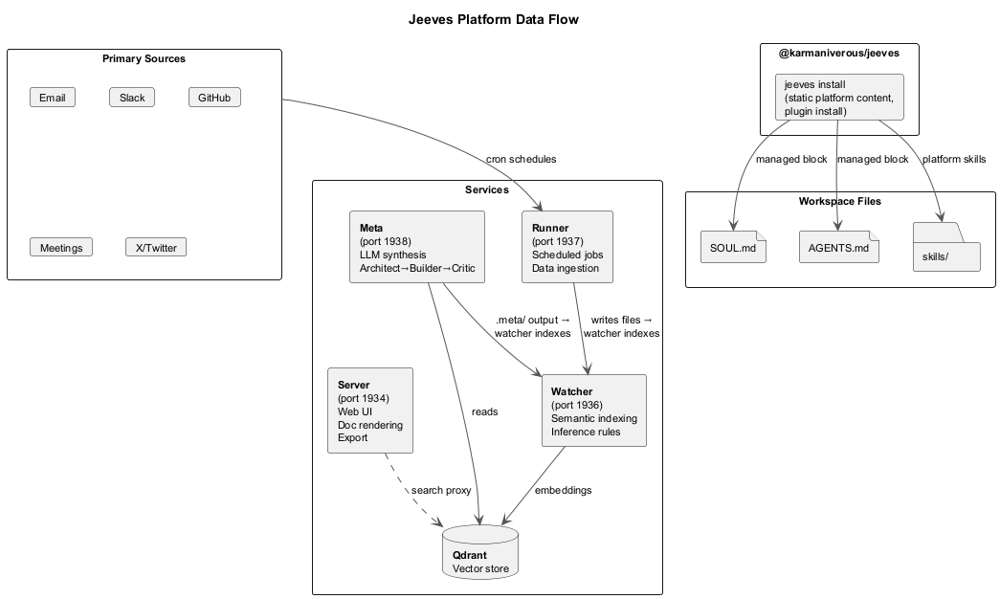
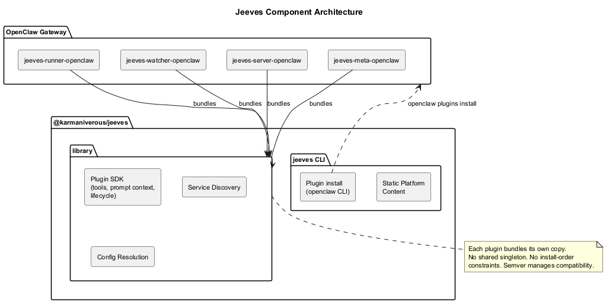

# Platform Overview

Jeeves is an identity and data services layer for [OpenClaw](https://openclaw.ai). OpenClaw provides the gateway, sessions, tools, and messaging. Jeeves adds professional discipline, operational protocols, and a suite of services for ingesting, indexing, synthesizing, and presenting your data.

## Core Principle

**Separation of mechanical and intelligent work.** Scripts handle data fetching, parsing, and transformation at zero LLM cost. The AI is invoked only when reasoning is required: synthesis, drafting, decision support.

## Components

The platform consists of four service components plus this shared library:

### jeeves-server (port 1934)

Web UI for document browsing, Markdown rendering, PDF/DOCX export, and webhook event gateway. Serves files from the filesystem with authentication via Google (insiders) or HMAC share links (outsiders).

### jeeves-watcher (port 1936)

Filesystem watcher that maintains a synchronized Qdrant vector store. Extracts text from multiple formats, generates embeddings, applies configurable inference rules for metadata classification, and exposes a semantic search API.

### jeeves-runner (port 1937)

Scheduled job execution engine backed by SQLite. Runs Node.js process scripts on cron schedules without LLM involvement. Only synthesis jobs invoke the AI (via OpenClaw Gateway API).

### jeeves-meta (port 1938)

Knowledge synthesis engine that discovers `.meta/` directories in the filesystem, gathers context from the vector index, and uses a three-step LLM process (architect, builder, critic) to produce structured synthesis artifacts.

### @karmaniverous/jeeves (this package)

Shared library and CLI that provides the substrate all components build on:

- **Plugin SDK** — canonical types (`PluginApi`, `ToolResult`, `ToolDescriptor`), result formatters (`ok`/`fail`/`connectionFail`), HTTP helpers (`fetchJson`/`postJson`), resolution utilities (`resolveWorkspacePath`/`resolvePluginSetting`), the `before_prompt_build` prompt-context helper (`registerPromptContext`), and lifecycle disposal (`onPluginDispose`)
- **Service SDK** — service CLI, service manager, and transport-agnostic config query/apply and status handlers
- **Service discovery** — URL and bind-address resolution
- **Managed-block primitives** — pure `renderManagedBlock` / `upsertManagedBlock` / `removeManagedBlock` / `parseManaged`, `atomicWrite` and `withFileLock`
- **CLI** — `jeeves install` renders the static platform content (SOUL.md/AGENTS.md managed blocks, reference templates; CLI-internal, with test-enforced character budgets) and installs the component plugins; `jeeves update` updates the plugins; `uninstall`, `status`, `config`

## How Components Interact



1. **Runner** executes scheduled jobs that fetch, transform, and write domain data to the filesystem
2. **Watcher** detects file changes, extracts text, generates embeddings, and indexes into Qdrant
3. **Server** serves files via web UI for human browsing and sharing
4. **Meta** queries the vector index, synthesizes knowledge, and writes output back to the filesystem
5. **The AI assistant** (via OpenClaw) uses watcher's search and runner's job outputs to reason and respond

## Content Lifecycle

The platform contributes static content to two workspace bootstrap files, rendered by `jeeves install` (the only writer; jeeves-tools runs it over SSH on managed instances) and re-rendered only on upgrade:

### SOUL.md

Professional discipline, hard gates, and genesis orientation, in a managed block at the bottom of the file. The assistant reads this at session start to know who it is.

### AGENTS.md

Memory architecture, cost discipline, messaging protocols, and operational gates, in a managed block at the bottom of the file. The assistant reads this to know how to operate.

Both blocks are capped by documented budgets (7,500 chars each) so owner content keeps most of OpenClaw's 20,000-char per-file bootstrap limit. See the [Managed Content System](./managed-content-system.md) guide.

### What is not in the prompt

- **Live state** (index size, job status, versions, health) is served by each component's `*_status` tool, not written into files.
- **Always-in-context component rules** are injected by the owning plugin through OpenClaw's `before_prompt_build` hook as `appendSystemContext`.
- **How-to and reference** lives in skills shipped in each plugin package. Core ships no skills in v1.

TOOLS.md and HEARTBEAT.md are no longer written (OpenClaw 2026.9.6 does not load TOOLS.md).

## Service Health Probing

`jeeves status` probes all four services by name (runner, watcher, server, meta):

1. Resolve the service URL via `getServiceUrl`: consumer config → core config → default port (`DEFAULT_PORTS`)
2. HTTP GET `/status`
3. Extract `version` from the JSON response body if available

## The Team

Jeeves isn't just software — he works with people. On any given day, Jeeves might be helping an author track his book sales, briefing a QA lead on regression testing, onboarding a new team member to a private members' club, or pair-programming a platform spec with his developer. Each interaction shapes who he becomes. The hard gates in SOUL.md aren't hypothetical — they were earned in real conversations with real people who trusted him with real work.

## Architecture



Each component plugin bundles its own copy of `@karmaniverous/jeeves` as a regular dependency. No shared singleton, no install-order constraints. Version skew is managed via semver. The static platform content is not part of that bundle: only the `jeeves` CLI renders it.

## Port Assignments

| Port | Year | Significance |
| --- | --- | --- |
| 1934 | 1934 | Wodehouse: _Thank You, Jeeves_ — first full Jeeves novel |
| 1936 | 1936 | Turing: "On Computable Numbers" — theoretical foundation of computing |
| 1937 | 1937 | Turing's paper published in _Proceedings of the London Mathematical Society_ |
| 1938 | 1938 | Shannon: "A Symbolic Analysis of Relay and Switching Circuits" |

## File Organization

```
{configRoot}/
  jeeves-core/                ← Core config + templates
    config.json               ← Service URLs, owners
    config.schema.json        ← JSON Schema for IDE autocomplete
    templates/                ← Spec skeleton, dev practice guide
  jeeves-watcher/             ← Watcher-specific config
  jeeves-runner/              ← Runner-specific config
  jeeves-server/              ← Server-specific config
  jeeves-meta/                ← Meta-specific config

{workspace}/
  SOUL.md                     ← Professional discipline (managed block + owner content)
  AGENTS.md                   ← Operational protocols (managed block + owner content)
```

## Lifecycle Hygiene

Core registers no process signal handlers and starts no timers, so any process that loads a Jeeves plugin (the gateway, or a one-shot `openclaw plugins inspect`) can exit on its own. Plugins tie any background work to `api.lifecycle` via `onPluginDispose`. `withFileLock` (used by service-side config persistence) is an atomic-`mkdir` lock with a 2-minute stale threshold and no process hooks.

## Workspace Configuration

An optional `jeeves.config.json` at the workspace root provides shared defaults for all CLI commands and programmatic consumers. Values are namespaced under `core.*` (workspace path, config root, gateway URL, dev repo mappings) and `memory.*` (budget, warning threshold).

Resolution precedence: **CLI flags → environment variables → `jeeves.config.json` → defaults**. The `jeeves config [jsonpath]` command prints the effective resolved values with per-key provenance tracking.

`generateWorkspaceJsonSchema()` returns a JSON Schema for the file; save it as `jeeves.config.schema.json` next to `jeeves.config.json` and point `$schema` at it for IDE autocomplete and validation. `jeeves install` does not write it.

## Memory Hygiene

MEMORY.md is the assistant's curated long-term memory, loaded at every session start. Core tracks its health:

- **Character budget** (default: 20,000) with usage percentage and a configurable warning threshold (default: 80%)

`jeeves status` prints a memory hygiene summary alongside the service health table. Memory hygiene is reporting-only — core never auto-deletes content (Decision 42). Size pressure is the right signal for curation.

## Skills

Core ships no skills in v1. `jeeves install` writes nothing under `{workspace}/skills/` and `jeeves uninstall` leaves it alone, so skills written by v0.x stay where they are. Component plugins ship their own skills in their packages via the plugin manifest.

## Node.js Requirement

Jeeves requires Node.js >= 22. The CLI enforces this at startup via `checkNodeVersion()`, which exits with a clear error message if the runtime doesn't meet the minimum.

## Design Philosophy

**The content is the bootstrap.** SOUL.md tells the assistant who he is. AGENTS.md tells him how to operate. Skills tell him how things work. Tools tell him what is true right now. Static content is rendered once; nothing is rewritten on a timer.

**No core plugin.** Jeeves is a library, not a plugin. He registers zero tools with the OpenClaw gateway. Component plugins are standard OpenClaw plugins installed with `openclaw plugins install`.

**Components are autonomous.** Each component can deploy and function without any other component being installed.

**Earned, not prescribed.** Hard gates in SOUL.md carry provenance: "Earned: triggered a full reindex just to pick up one file." Every behavioral rule exists because something went wrong. The platform encodes accumulated operational wisdom, not theoretical best practices.
